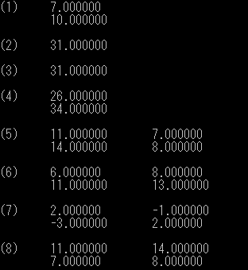

# 問3 構造体
構造体を定義して以下の行列を計算する関数を作成する。

$$
x=\begin{pmatrix}5\\7\end{pmatrix}
\quad y=\begin{pmatrix}2\\3\end{pmatrix}
\quad A=\begin{pmatrix}1 & 3\\4 & 2\end{pmatrix}
\quad B=\begin{pmatrix}2 & 1\\3 & 2\end{pmatrix}
$$

## (1) $x + y$
## (2) $x \cdot y$
## (3) $^t xy$
## (4) $Ax$
## (5) $AB$
## (6) $BA$
## (7) $B^{-1}$
## (8) $^t (AB)$

---
## sub.c
```C
typedef struct
{
    int row;
    int col;
    double elem[2][2];
}matrix;

void init_matrix(matrix a)
{
    for(int i=0; i<2; i++)
    {
        for(int j=0; j<2; j++)
        {
            a.elem[i][j] = 0.0;
        }
    }
}

matrix sum(matrix a, matrix b)
{
    matrix result;

    if(a.row==b.row && a.col==b.col)
    {
        int row = a.row, col = a.col;
        result.row = row;
        result.col = col;

        for(int i=0; i<row; i++)
        {
            for(int j=0; j<col; j++)
            {
                result.elem[i][j] = a.elem[i][j] + b.elem[i][j];
            }
        }
        return result;
    }
    else
    {
        result.row = 0;
        result.col = 0;
        return result;
    }
}

double inner_product(matrix a, matrix b)
{
    if(a.row==b.row && a.col==b.col)
    {
        int row = a.row, col = a.col;
        double result=0.0;

        for(int i=0; i<row; i++)
        {
            for(int j=0; j<col; j++)
            {
                result += a.elem[i][j] * b.elem[i][j];
            }
        }
        return result;
    }
    else
    {
        return 0;
    }
}

matrix product(matrix a, matrix b)
{
    matrix result;

    if(a.col==b.row)
    {
        int row = a.row, col = b.col;
        result.row = row;
        result.col = col;

        for(int i=0; i<row; i++)
        {
            for(int j=0; j<col; j++)
            {
                result.elem[i][j] = 0.0;
                for(int k=0; k<a.col; k++)
                {
                    result.elem[i][j] += a.elem[i][k] * b.elem[k][j];
                }
            }
        }
        return result;
    }
    else
    {
        result.row = 0;
        result.col = 0;
        return result;
    }
}

matrix transpose(matrix a)
{
    matrix result;
    int row = a.col, col = a.row;
    result.row = row;
    result.col = col;

    for(int i=0; i<row; i++)
    {
        for(int j=0; j<col; j++)
        {
            result.elem[i][j] = a.elem[j][i];
        }
    }
    return result;
}

matrix inverse(matrix a)
{
    matrix result, sweep;

    if(a.row==a.col)
    {
        int N = a.row;
        result.row = N;
        result.col = N;
        sweep.row = N;
        sweep.col = N;

        for(int i=0; i<N; i++)
        {
            for(int j=0; j<N; j++)
            {
                sweep.elem[i][j] = a.elem[i][j];
                result.elem[i][j] = (i==j) ? 1.0:0.0;
            }
        }
        
        for(int i=0; i<N; i++)
        {
            double cash_1, cash_2, abs = fabs(sweep.elem[i][i]);
            int abs_row = i;

            for(int j=i+1; j<N; j++)
            {
                if(fabs(sweep.elem[j][i])>abs)
                {
                    abs = fabs(sweep.elem[j][i]);
                    abs_row = j;
                }
            }

            if(abs < 1e-16)
            {
                result.row = 0;
                result.col = 0;
                return result;
            }
            else if(i != abs_row)
            {
                for(int k=0; k<N; k++)
                {
                    cash_1=sweep.elem[abs_row][k];
                    cash_2=result.elem[abs_row][k];
                    sweep.elem[abs_row][k] = sweep.elem[i][k];
                    result.elem[abs_row][k] = result.elem[i][k];
                    sweep.elem[i][k] = cash_1;
                    result.elem[i][k] = cash_2;
                }
            }

            cash_1 = 1/sweep.elem[i][i];
            for(int j=0; j<N; j++)
            {
                sweep.elem[i][j] *= cash_1;
                result.elem[i][j] *= cash_1;
            }

            for(int j=0; j<N; j++)
            {
                if(i!=j)
                {
                    cash_2 = sweep.elem[j][i];
                    for(int k=0; k<N; k++)
                    {
                        sweep.elem[j][k] -= cash_2*sweep.elem[i][k];
                        result.elem[j][k] -= cash_2*result.elem[i][k];
                    }
                }
                
            }
        }
        return result;
    }
    else{
        result.row = 0;
        result.col = 0;
        return result;
    }
}
```

---

## main.c

```C
#include <stdio.h>
#include <stdlib.h>
#include <time.h>

int main(void)
{
    int min,max,num;
    min = 1;
    max = 16;
    num = max-min+1;

    int i,k,array[num];

    srand((unsigned int)time(NULL));

    for(i=0; i<num; i++)
    {
        do
        {
            array[i] = rand()%max + min;
            for(k=0; k<i; k++)
            {
                if(array[i] == array[k])
                {
                    break;
                }
            }
        } while (i != k);
    }

    for(i=0; i<num; i++)
    {
        if(i<num-1)
        {
            printf("%d,", array[i]);
        }
        else
        {
            printf("%d\n", array[i]);
        }
    }

    return 0;
}
```
---
## 出力結果

[](./image/result.png)

---
- [問1へ](https://github.com/Kouji-Tanaka/B4_Programming1 "Kouji-Tanaka/B4_Programming1")
- [問2へ](https://github.com/Kouji-Tanaka/B4_Programming2 "Kouji-Tanaka/B4_Programming2")
- [問4へ](https://github.com/Kouji-Tanaka/B4_Programming4 "Kouji-Tanaka/B4_Programming4")
- [問5へ](https://github.com/Kouji-Tanaka/B4_Programming5 "Kouji-Tanaka/B4_Programming5")
- [問6へ](https://github.com/Kouji-Tanaka/B4_Programming6 "Kouji-Tanaka/B4_Programming6")

<div>
    <a href="#">
        [Topへ]
    </a>
</div>
